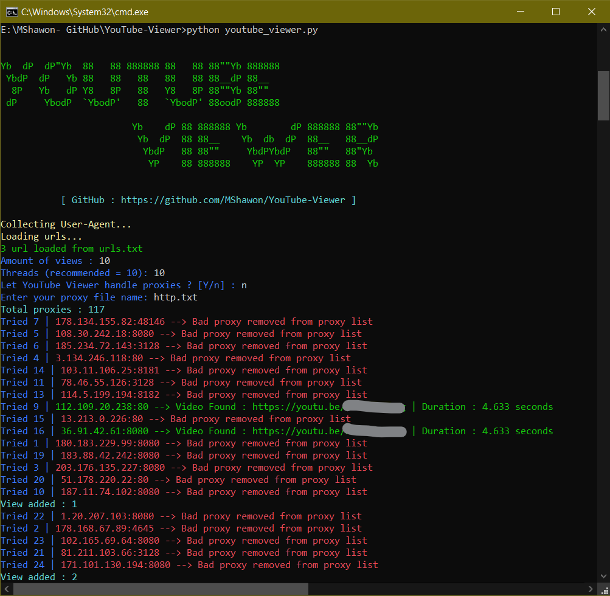

    Yb  dP  dP"Yb  88   88 888888 88   88 88""Yb 888888 
     YbdP  dP   Yb 88   88   88   88   88 88__dP 88__   
      8P   Yb   dP Y8   8P   88   Y8   8P 88""Yb 88""   
     dP     YbodP  `YbodP'   88   `YbodP' 88oodP 888888 

                         Yb    dP 88 888888 Yb        dP 888888 88""Yb 
                          Yb  dP  88 88__    Yb  db  dP  88__   88__dP 
                           YbdP   88 88""     YbdPYbdP   88""   88"Yb  
                            YP    88 888888    YP  YP    888888 88  Yb

# YouTube Viewer
Simple program to increase YouTube views written in Python.

**Discalimer:** This has been developed for educational purposes only.
# Requirements
 * Python 3.x
 * High speed Internet Connection
 * Good proxy list
  
# Installation 
 Open command prompt and type
 ```bash
 $ git clone https://github.com/MShawon/YouTube-Viewer.git

 $ cd YouTube-Viewer

 $ pip install -r requirements.txt
 ```
## Important
Check your chrome browser version and download same versions chromedriver.exe from https://chromedriver.chromium.org/downloads here and place it in the YouTube-Viewer folder.

# Usage
 * Put youtube video links in the urls.txt. For multiple videos place urls in multple lines. (To find video link in YouTube click share and copy.)
 * Open command prompt in YouTube-Viewer folder and type
    ```python
    $ python youtube_viewer.py
    ```
   * Enter amount of views you want.
   * Input proxy list or let program to automatically handle proxies.

 
