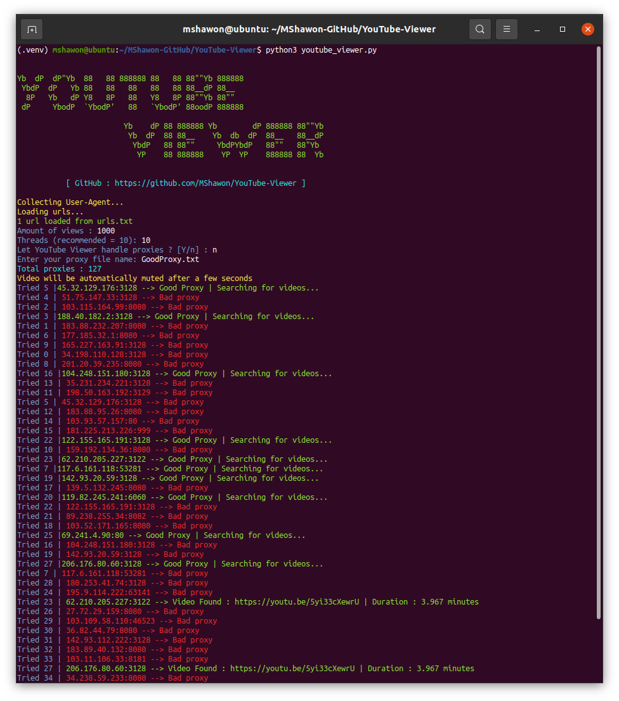

<p align="center">


<a href="https://github.com/MShawon/YouTube-Viewer/releases"></a>
<a href="https://github.com/MShawon/YouTube-Viewer/issues?q=is%3Aissue+is%3Aclosed"></a>
<a href="https://github.com/MShawon/YouTube-Viewer/issues?q=is%3Aissue+is%3Aopen"></a>
</p>
<p align="center">
<a href="https://github.com/MShawon/YouTube-Viewer/blob/master/DONATE.md"></a>
<a href="https://github.com/MShawon/github-clone-count-badge"></a>
</p>

    Yb  dP  dP"Yb  88   88 888888 88   88 88""Yb 888888
     YbdP  dP   Yb 88   88   88   88   88 88__dP 88__   
      8P   Yb   dP Y8   8P   88   Y8   8P 88""Yb 88""   
     dP     YbodP  `YbodP'   88   `YbodP' 88oodP 888888 

                         Yb    dP 88 888888 Yb        dP 888888 88""Yb 
                          Yb  dP  88 88__    Yb  db  dP  88__   88__dP 
                           YbdP   88 88""     YbdPYbdP   88""   88"Yb  
                            YP    88 888888    YP  YP    888888 88  Yb

# YouTube Viewer
Simple program to increase YouTube views written in Python.

**Discalimer:** This has been developed for educational purposes only.

**Cons:** Try not to use this script every day. Run this once or twice a week with newer proxies. Guess this will reduce the view decrease issue.
# Risks
 Something new came up https://github.com/MShawon/YouTube-Viewer/issues/40 . Please use at your own risk.
# Issues
 Before opening an issue, please read this page thoroughly. Maybe someone already faced the same problem you have right now. So it's always a good idea to check the answer from issues first. If your problem isn't there, feel free to open an issue.

# Requirements
 * Python 3.x
 * High speed Internet Connection
 * Good proxy list (http, https, socks4, socks5)
 * Google Chrome installed on your OS (not Chromium)
 
# New feature
 Now program can search youtube with keyword and find video with video title. To do this you need to know what keyword can find your video on youtube search engine. Also you need to provide **exact** video title.Put keyword and title like this format `keyword : video title` in **search.txt** 
 
 For example `truss 101 : Analysis of Truss Structures Using Truss 101 Software`. If I search on YouTube **truss 101**, returned results shows my video. So here **truss 101** is the keyword and **Analysis of Truss Structures Using Truss 101 Software** is the video title.

# Windows
* ## Binary Release

  For windows you can download binary releases from **[Binary releases](https://github.com/MShawon/YouTube-Viewer/releases)** or you can install it from source. To do so keep reading. 
  
* ## Installation 
 
  Open command prompt and type
  ```bash
  $ git clone https://github.com/MShawon/YouTube-Viewer.git

  $ cd YouTube-Viewer

  $ pip install -r requirements.txt
  ```
* ## Important
   * Check your Google Chrome version and download same version **chromedriver.exe** from https://chromedriver.chromium.org/downloads here and place it in the **chromedriver_win32** folder.

   * If you've got a large proxy collection, you should run this command to filter Good proxies. Then use **GoodProxy.txt** for proxy in **youtube_viewer.py**
      ```
      $ python proxy_check.py
      ```

   * After closing program, if chromedrivers are still running. You may want to double click **killdrive.bat** to close all chrome instances.

* ## Test
  This will clear your confusion as main program will run in the background.
   ```
   $ python test.py
   ``` 

* ## Usage
   * Put youtube video links in the urls.txt. For multiple videos place urls in multple lines. (To find video link in YouTube click share and copy)
   * Open command prompt in YouTube-Viewer folder and run
        ```
        $ python youtube_viewer.py
        ```
   * Enter amount of views you want.
   * Provide number of threads. 
   * Input proxy list or let program to handle proxies automatically.

    

# Linux
* ## Installation 
 
  Open your favourite terminal and run
  ```bash
  $ git clone https://github.com/MShawon/YouTube-Viewer.git

  $ cd YouTube-Viewer

  $ pip3 install -r requirements.txt
  ```
* ## Important
   * Check your Google Chrome version and download same version **chromedriver** from https://chromedriver.chromium.org/downloads here and place it in the  **chromedriver_linux64** folder.

   * If you've got a large proxy collection, you should run this command to filter Good proxies. Then use **GoodProxy.txt** for proxy in **youtube_viewer.py**
        ```
        $ python3 proxy_check.py
        ```

   * After closing program, if chromedrivers are still running. Open your terminal and run 
      ```
      ps aux | awk '/chrome/ { print $2 } ' | xargs kill -9
      ```
* ## Test
  This will clear your confusion as main program will run in the background.
   ```
   $ python3 test.py
   ``` 

* ## Usage
   * Put youtube video links in the urls.txt. For multiple videos place urls in multple lines. (To find video link in YouTube click share and copy)
   * Open command prompt in YouTube-Viewer folder and run
        ```
        $ python3 youtube_viewer.py
        ```
   * Enter amount of views you want.
   * Provide number of threads. 
   * Input proxy list or let program to handle proxies automatically.

   

